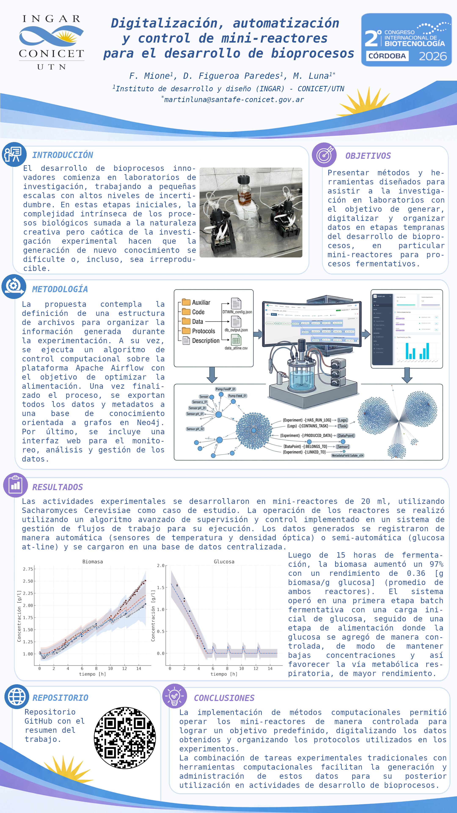

# Digitalización, automatización y control de mini-reactores para el desarrollo de bioprocesos

Repositorio público del trabajo presentado como poster digital en el *2do Congreso Internacional de Biotecnología - Cordoba 2026*.

## Autores
Federico M. Mione $^{1}$,  Danilo A. Figueroa Paredes $^{1}$, Martin F. Luna $^{1,*}$.

$^{1}$ *INGAR (CONICET - UTN). Avellaneda 3657, Santa Fe, Argentina*. 

$^{*}$ *martinluna@santafe-conicet.gov.ar*

## Resumen ID 2255

El desarrollo de bioprocesos innovadores comienza en laboratorios de investigación, trabajando a pequeñas escalas con altos niveles de incertidumbre. En estas etapas iniciales, la complejidad intrínseca de los procesos biológicos sumada a la naturaleza creativa pero caótica de la investigación experimental hacen que la generación de nuevo conocimiento se dificulte o, incluso, sea irreproducible. El avance de métodos de ciencia de datos e inteligencia artificial promete resolver estos problemas aplicando técnicas que han probado ser muy efectivas en otros ámbitos, pero cuya extrapolación a laboratorios de desarrollo no es directa debido a la diferencia en la cantidad y calidad de los datos.

Este trabajo tiene como objetivo presentar métodos y herramientas diseñados para asistir a la investigación en laboratorios con el objetivo de generar, digitalizar y organizar datos en etapas tempranas del desarrollo de bioprocesos, en particular mini-reactores para procesos fermentativos.

Las actividades experimentales se desarrollaron en dos mini-reactores de 20 ml, utilizando Saccharomyces cerevisiae como caso de estudio. Tras una fase batch inicial, los reactores se operaron en modo fed-batch con alimentación mediante pulsos de un medio rico en glucosa, utilizando un algoritmo de control con el objetivo de maximizar la cantidad de biomasa. Los datos generados se registraron de manera automática (sensores de temperatura y densidad óptica) o semi-automática (glucosa at-line) en una base de datos relacional y se usaron para recalibrar el controlador.

Luego de 15 horas de fermentación, la biomasa aumentó un 97% con un rendimiento de 0.36 [g biomasa/g glucosa] (promedio de ambos reactores). Se registraron en total 21247 datos de sensores y 10 datos at-line, que se cargaron en una base de datos de grafos. Todos los protocolos, código de los algoritmos y metadatos del experimento se cargaron y organizaron en un sistema de gestión de experimentos.

La implementación de métodos computacionales permitió operar los mini-reactores de manera controlada para lograr un objetivo predefinido, digitalizando los datos obtenidos y organizando los protocolos utilizados en los experimentos. La combinación de tareas experimentales tradicionales con herramientas computacionales facilitan la generación y administración de estos datos para su posterior utilización en actividades de desarrollo de bioprocesos.

**Palabras Clave:** Digitalización, Automatización, Mini-reactores

## Poster

## Licencia

Este proyecto se encuentra bajo una Licencia MIT. Visualzar el archivo [LICENSE](./LICENSE) para más detalles.
